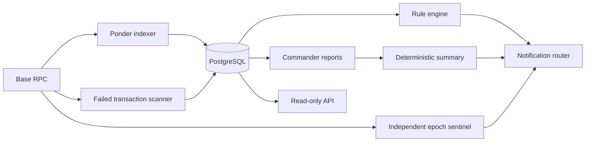

# NARA Swarm Monitor

[](https://github.com/NARAProtocol/nara-swarm-monitor/actions/workflows/monitor-ci.yml)
[](https://nodejs.org/)
[](https://base.org/)
[](https://ponder.sh/)
[](https://www.typescriptlang.org/)

Read-only operations intelligence for the fresh NARA v4 protocol on Base.

NARA Swarm Monitor indexes protocol events, derives operational signals, scans
failed transactions, and exposes evidence through a read-only API. It is built
to fail closed: an unknown, retired, or incomplete deployment configuration
stops startup instead of silently monitoring the wrong contracts.

> [!IMPORTANT]
> This repository monitors the fresh v4 deployment only. It does not send
> protocol transactions, hold signing keys, or support retired v3 contracts.

> [!WARNING]
> **Technical live testing on Base mainnet — not public product availability.**
> The monitored canonical v4 contracts and NARA/USDC pool use real assets.
> Alerts, scores, reports, wallet views, and summaries are operator telemetry,
> not investment research, trading signals, personalized advice, or
> recommendations to transact. This repository does not establish that any
> product or interface is available, production-ready, audited, safe, legally
> approved, or available in any jurisdiction, and contains no evidence of a
> completed jurisdiction-specific qualified legal review. Onchain
> transactions are irreversible, liquidity may be limited, and token values
> can fall to zero.

## What It Does

- Indexes the active NARA token, engine, liquidity hook, vault, and compounder on Base.
- Builds deterministic protocol, wallet, position, treasury, and admin views in PostgreSQL.
- Evaluates evidence-backed alert rules with deduplication and severity 1–5 scoring.
- Scans reverted transactions involving monitored contracts.
- Produces structured Commander reports and deterministic AI summaries.
- Independent five-minute epoch sentinel with RPC failover and bounded alert repeats.
- Autonomous 10-minute background diagnostic cycle for indexed and database-backed checks.
- Interactive Telegram Console Bot (`@naraswarmbot`) with native chat menu (`/wallet`, `/health`, `/whales`, `/cliffs`, `/status`, `/contracts`, `/ping`).
- Factual wallet activity report showing onchain balances, locks, weights, and currently claimable amounts.
- Routes proactive emergency alerts to Telegram, Discord, console, or generic webhooks.
- Independently watches the canonical NARA/USDC v4 Hook and notifies Telegram
  about confirmed buys at or above the configured USDC threshold.
- Polls engine epoch freshness directly so a stalled keeper is detected before user calls fail.
- Serves monitoring data through a bounded, read-only API and GraphQL explorer.

## Architecture



The indexer is the protocol's observation layer. Derived reports never replace
onchain evidence; every operational conclusion is traceable to indexed state,
events, or transaction receipts.

## Deployment Profiles

| Profile | Purpose | Required surfaces |
| --- | --- | --- |
| `core` | Deployed-core observation profile | Token, engine, liquidity hook, liquidity vault, compounder |
| `full` | Future complete protocol profile | Core plus position, bond, ops, staking, basket, genesis, and bribe surfaces |

Deferred contracts use empty address lists in `core`. The monitor never invents
placeholder production addresses or deploys contracts merely to satisfy its
configuration.

The Position NFT Phase-2 baseline is deployed, tested under its recorded
release gates, source-verified, and Safe-finalized. It remains intentionally
unset because the canonical manifest records `integrationReady: false`;
deployment alone does not authorize consumer integration.

## Quick Start

### Requirements

- Node.js 22
- npm 10.9.2
- PostgreSQL
- A Base mainnet RPC endpoint

### Install and verify

```bash
git clone https://github.com/NARAProtocol/nara-swarm-monitor.git
cd nara-swarm-monitor
npm ci
cp .env.example .env.local
```

Populate `.env.local` with verified fresh-v4 deployment values, then run:

```bash
npm run validate:v4-env
npm run codegen
npm run typecheck
npm test
npm run dev
```

The local Ponder API is available at `http://localhost:42069` by default.
Environment files containing secrets are ignored by Git.

## Operating the Monitor

Run the indexer:

```bash
npm run start
```

Run one read-only monitoring cycle:

```bash
npm run monitor:cycle
```

Check configuration, API, and database health:

```bash
npm run monitor:health
```

Preview a cycle without writing reports or sending notifications:

```bash
npm run monitor:cycle:dry-run
```

## Verification

The complete local quality gate is:

```bash
npm run verify
```

It checks documentation drift, secret leakage, environment rules, deterministic
test suites, repository policy, locked dependencies, generated Ponder types,
and TypeScript correctness. CI runs the same gate on every push and pull
request.

Maintainers can separately verify the live GitHub branch, Actions, CodeQL,
Dependabot, secret-scanning, and private-reporting settings:

```bash
npm run audit:github-settings
```

That command is read-only and requires an authenticated GitHub CLI session with
access to the repository settings.

## Documentation

| Document | Use it for |
| --- | --- |
| [Architecture](docs/MONITOR_ARCHITECTURE.md) | Data flow, indexed tables, derived views, and agent boundaries |
| [Environment variables](docs/ENVIRONMENT_VARIABLES.md) | Complete configuration reference |
| [Operator runbook](docs/OPERATOR_RUNBOOK.md) | Startup order and routine operations |
| [Deployment checklist](docs/DEPLOYMENT_CHECKLIST.md) | Operator deployment checks and smoke tests |
| [Recovery procedures](docs/RECOVERY_PROCEDURES.md) | Diagnosing and recovering from runtime failures |
| [Command reference](docs/COMMANDS.md) | Every supported npm command |
| [Repository governance](docs/REPOSITORY_GOVERNANCE.md) | Machine-enforced files and live GitHub settings |
| [Repository standard](docs/GITHUB_REPOSITORY_STANDARD.md) | Required quality pattern for GitHub changes |
| [Security policy](SECURITY.md) | Private vulnerability reporting |
| [Contributing](CONTRIBUTING.md) | Branch, commit, testing, and pull-request rules |

## Safety Model

- Protocol addresses are environment-only and validated at startup.
- Retired deployment addresses are explicitly blocked.
- Private keys are neither requested nor supported.
- API endpoints are read-only and enforce bounded result limits.
- AI summaries explain deterministic evidence; they do not control protocol
  state or independently determine alert severity.
- ABI drift checks bind integrations to generated active-v4 artifacts.

See [SECURITY.md](SECURITY.md) before reporting a vulnerability. Never include
private keys, seed phrases, RPC credentials, or exploitable production details
in a public issue.

## Project Status

The repository currently supports the `core` configuration profile. This source
status does not assert that a hosted production monitor is running.
Basket-specific monitoring remains disabled until verified fresh basket manager
and collector deployments exist. The `full` profile intentionally remains
fail-closed until every required surface is available.

## License

No open-source license has been granted yet. All rights are reserved unless a
license file is added by the repository owner.
